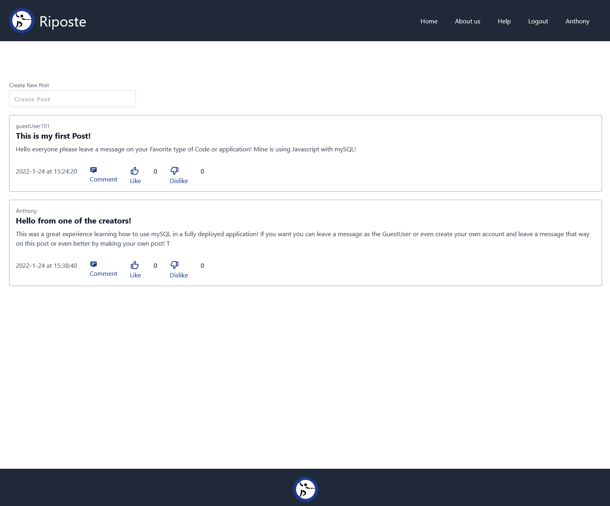

# Riposte 11/2/2021

# Table of Contents
* [Contributers](#contributers)
* [Image](#image)
* [Links](#links)
* [Overview](#overview)
* [Ideas](#ideas)
* [Tables](#tables)
* [UserStory](#user story)
* [Summery](#summery)
* [Allocations](#allocations)

## Contributers 
* Anthony
* Philip
* Terrence
* Graham

# Image
  

# Links
* Deployed page: https://ripost-forum.herokuapp.com/
* Github page: https://github.com/Terrence-Me/project2-team-one

# Testing
You can access the webpage without creating an account by using a premade account!  
### Email Address: guestUser101@gmail.com  
### Password: Guest101

# Overview
* Must use Node.js and express.js to create a RESTful API
* Must use HandleBars.js as the template engine
* Must use MySQL and the Sequelize ORM for the database
* Must have both GET and POST routes for retrieving and adding new data
* Must use at least one new library, package, or technology that we haven’t discussed
* Must have a folder structure that meets the MVC paradigm
* Must include authentication (express-session and cookies)
* Must protect API keys and sensitive information with environment variables
* Must be deployed using Heroku (with data)
* Must have a polished UI
* Must be responsive
* Must be interactive (i.e., accept and respond to user input)
* Must meet good-quality coding standards (file structure, best practices, etc.)
* Must have professional README (unique name, description, link to the deployed app)

## Ideas
Chat server/chat board/chat room (socket io, firebase)
* Create new posts that can be commented on
    1. Able to leave messages/comment
    2. Timestamps on messages
    3. Need to login to start chatting/posting
        a. Verification with email
    4. Tags 
        a. Normal user (can leave messages/delete their messages)
        b. Veteran user	
        c. Admin (can leave messages/delete any message/moderate)

# Tables
    1. Post table
    2. User table
    3. Comment table
# USER STORY:
AS a TechCommenting service Manager: 
I WANT a webpage/website that allows my users to create an account with a unique name and email so that they may post and comment on posts.
AS a user I should be able to see posts and create posts
AS a user I should be able to click on a post and then comment on that post

# Summary:
This will be a webpage that is like a posting service that users will be able to post new threads that other users can comment on. In order for a user to post or comment they must be logged in, which means they will have to create a username and password with a unique email. Once logged in their session will be saved even after they leave the page but only for a short while using cookies. However the user can log out when they wish.

# Project Pieces/Allocations:
* Database (backend)
    1. Post table
    2. Comment table
    3. User table
    4. Schema
    5. Seeds
* FrontEnd
    1. Html
    2. Javascripts
    3. CSS
* BackEnd
    1. Routes
    2. Config
    3. Javascripts

